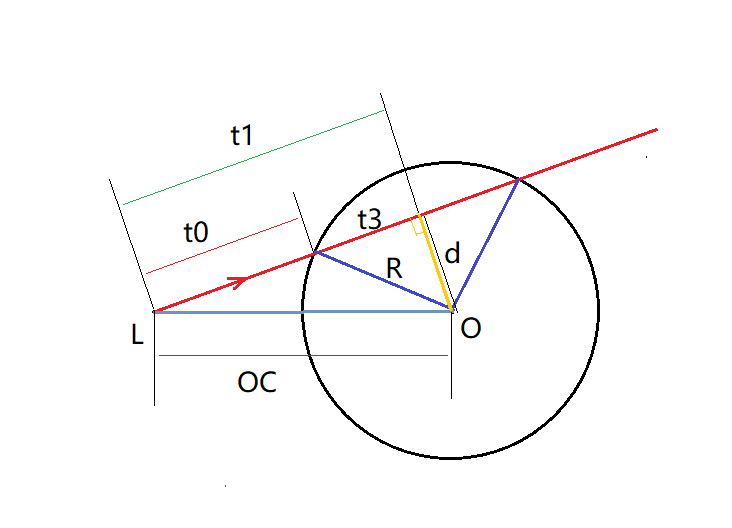
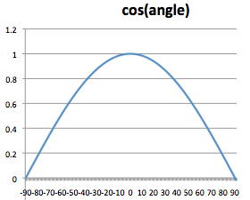

嗯，其实渲染球体，可以看做就是一个2d圆形图案+渲染光泽的函数。

定义球体结构——半径，球心坐标

```c++
struct Sphere {
    vec3 center;  
    float radius; 
};
```

定义光线——光源坐标，方向

```c++
struct Ray {
    vec3 origin; 
    vec3 direction; 
};
```
 
检测“光线”与“球体”是否相交，若未相交返回false，相交返回从光源到球面的距离

数学解释如下


 
图中红色线条即光线，重要线段已标注变量，光照方向记作向量Dir。

 

首先，需要判断光线是否照射到球面，转化为数学问题，即光线所在直线是否与球相交。

在一个平面内，一条线与一个球形的关系有三种——相交、相切、相离。

其中相切作为一个中间状态是很好判断的，当光线与球面相切，必然存在：

R = d

t1² = OC² - R² 

如此，余下的两种状态也很好判断了。

假若线段t1的长度小于从光源出发到球形的切线段长，则光线必然与球形相交；反之，则与球形相离。

 

接下来，计算从光源到球面相交点的距离。 

如图中所示，最终所求距离即线段t0长度：

t1 = OC·Dir　　（此处用到点乘）

d² = OC² - t1²

t3² = R² - d²

t0 = t1 - sqrt (t3)

代码表示如下：
```c++
float intersectSphere(in Ray ray, in Sphere sphere) {
    vec3 co = ray.origin - sphere.center;

    float discriminant = dot(co, ray.direction) * dot(co, ray.direction)
            - (dot(co, co) - sphere.radius * sphere.radius);

    if (discriminant >= 0.0)    //相交或相切
        return -dot(co, ray.direction)-sqrt(discriminant);    //返回光源到球面距离
    else     //相离返回-1
        return -1.;
}
```

最后，是光照漫反射的方程，这里用到物理学上的兰伯特余弦定律（Lambert Cosine's Law），即光照漫反射时的强度，遵循光线向量与法线向量间夹角余弦值的变化。

如下图，即随着光线向量与法线夹角增大，漫反射光的强度越弱。



漫反射代码如下：
```c++
vec4 diffuse(in vec3 surface, in vec3 center, in vec4 color, in vec3 litePos) {
    // Surface normal
    vec3 n = normalize(surface - center);
    
    // Light direction from surface
    vec3 l = normalize(litePos - surface);

    // The diffuse equation
    return color * max(0.0, dot(n, l));
}
```
最终返回反射光的颜色。

绘制阶段。

```c++
void mainImage( out vec4 fragColor, in vec2 fragCoord ) {
    float x = fragCoord.x / iResolution.x; 
    float y = fragCoord.y*.6 / iResolution.y; 
    vec4  m  = iMouse / iResolution.xyxy;
    
    x = x * 3.0 ;
    y = y * 3.0 - 1.;   
    
    vec3 pixelPos = vec3(x, y, 0);

    vec3 eyePos = vec3(0, 0, -4); 
    
    vec3 rayDir = normalize(pixelPos - eyePos)*(1.);
    
    Sphere sphere = Sphere(vec3(3.5, 0., 5.0), 1.0); 

    float eyeToSphere = intersectSphere(Ray(eyePos, rayDir), sphere);
    
    fragColor = vec4(0.1, 0.1, 0.1, 1);
   
    if (eyeToSphere >= 0.)
    {
        //漫射颜色
        vec4 diffuseColour =  vec4(0.4,0.4,0.4,1.);

        //周边颜色
        vec4 ambientColour =  vec4(0.8,0.1,0.1,1.);

        //光亮位置
        vec3 litePos = vec3(m.x*10., m.y*10., 1.);
        
        fragColor = ambientColour + diffuse(eyePos + eyeToSphere * rayDir, sphere.center, diffuseColour, litePos);
    }
  } 
  ```

绘制效果：
<iframe width="640" height="360" frameborder="0" src="https://www.shadertoy.com/embed/MsffW4?gui=true&t=10&paused=true&muted=false" allowfullscreen></iframe>