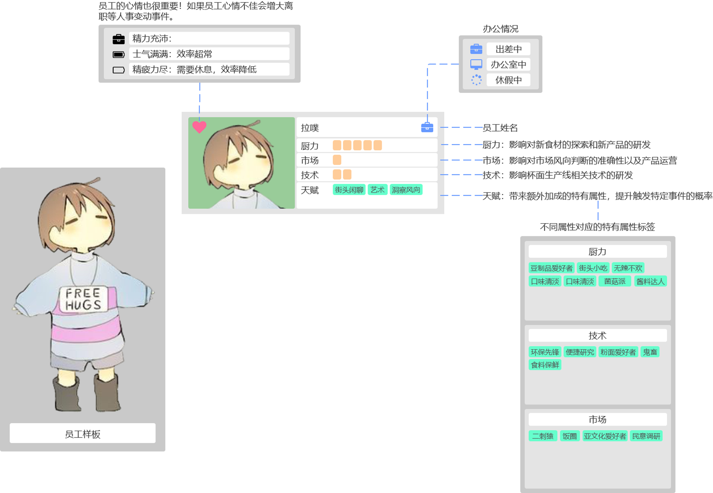
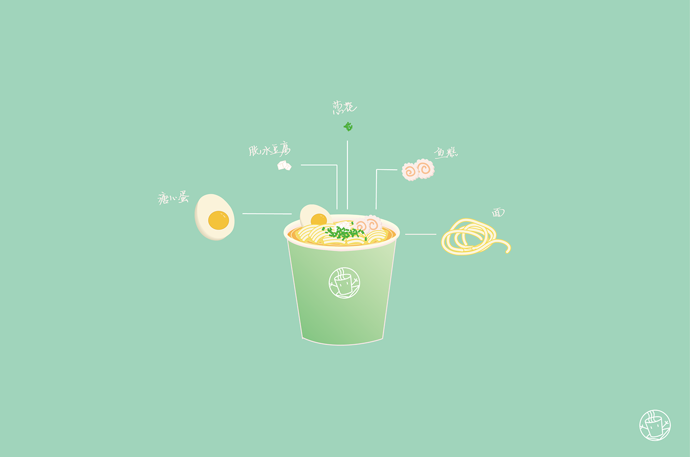
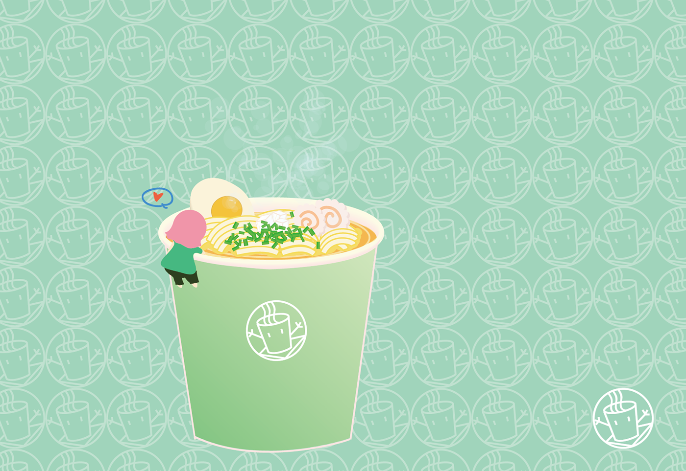

### 前序

>2017年12月1日【子虚快线栏目】 
>播报员:“刚刚得到快报，子虚市唯一一家杯面公司【滑稽杯面】因为经营不善将于月底正式关张，全部产业将于12月31日进行拍卖。这次滑稽杯面倒闭无疑给了杯面爱好者们沉重的一击，不久之后，大家在超市就再也见不到陪伴大家多年的滑稽杯面了嘤嘤嘤（声泪俱下）...... 
> 
>我:怎么会......这样...... 
> 
>（独白）我最喜欢的食物，就是杯面。 
>（回忆，画面跳转）（幼儿园。 
>老师:下一位——拉普拉斯，你最喜欢的食物是什么呢？ 
>我:我最喜欢的食物是杯面！（骄傲脸） 
>同学1:什么呀，这家伙居然最喜欢杯面诶。 
>同学2:除非遇到自然灾害，否则谁会吃那个啊... 
>同学3:真是滑稽呢啊哈哈哈哈哈 
>... 
>我:...（逐渐石化）为什么大家...无法理解...杯面啊，是一种有无限可能性的食物啊！ 
>（被嗤笑和回忆湮没） 
> 
>（滑稽杯面生产的诸多黑暗料理拉面，间接解释了为何会倒闭，画面轮放直到新闻播报公司破产。） 
> 
>（回到现实） 
>我:不可以，这不是我想看到的... 
>（走马灯） 
>无数个夜晚，无论是熬夜念书还是加班工作，陪在我身边的就是杯面啊！我要... 
> 
>（闪闪发光，动画，手伸向存钱罐） 
> 
>12月31日（拍卖现场） 
>我:只有我一个...吗？（呆） 
>拍卖师:起拍价——1000元！ 
>我:...1000！ 
>拍卖师:一千元一次，一千元两次，一千元三次，成交！恭喜！这家公司是您的了！ 
>我...（呆若木鸡）好...便宜... 
> 
> 
>【开始运作】   
> 
> 
>来到公司，一家破旧的地下室 。 
> （经典车滚草灰色场景，弹出秘书的对话框） 
> 
>？？？：（鸡冻）老板！ 
>（人物出现） 
>A酱：老板您好！我是A酱 ，是这里的秘书，我也是怀抱着一颗热爱杯面的心踏入了这个行业，（夸张的眼泪）如果您不嫌弃的话，请允许我继续担任您的秘书吧！QAQ。 
> 
>我：那就...多多关照了。让我们一起创造杯面的辉煌吧！（双手合掌，喜极而泣，希望） 
> 
>A酱：那么首先，请老板为我们的背杯面司起一个新名字吧！ 
>->_拉噗 杯面  
>A酱：拉噗杯面！真是个好名字呢！寓意着我们充满希望的未来！ 
> 
>A酱：那么接下来，开始学习制作杯面吧！ 
>A酱：杯面有三大主要成分，即汤底、菜包和面条。下面先进行汤底的制作吧！ 
> 
>【tbc...】 

### Axure原型（未完待续）

[地址](https://ylt4qc.axshare.com/#g=1&p=home)

### 员工

### 杯面概念图

（其实是AI练习作，话说AI真的好麻烦→_→

