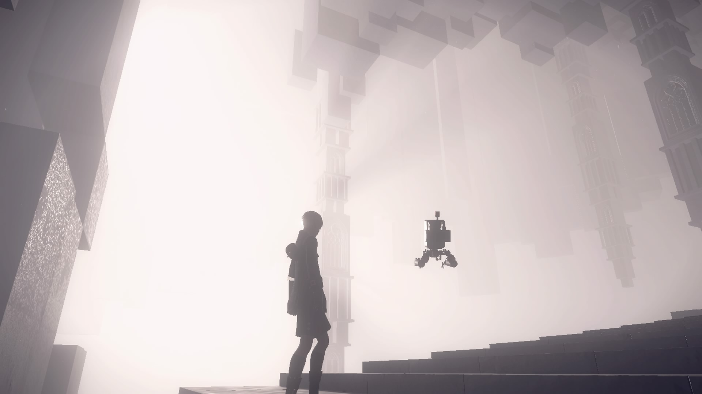
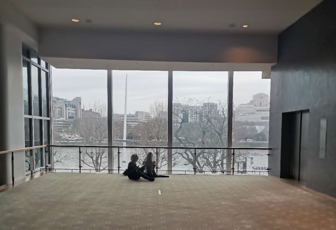
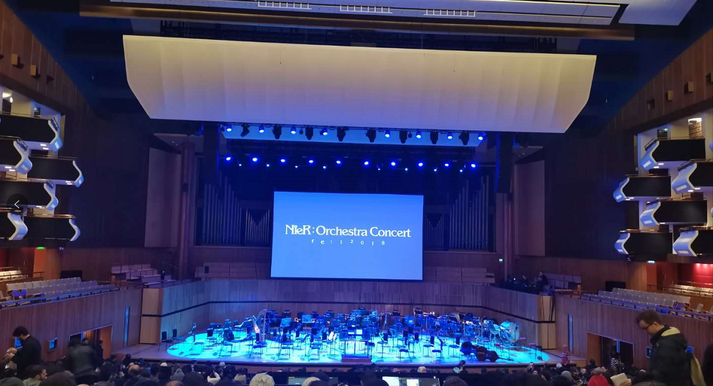
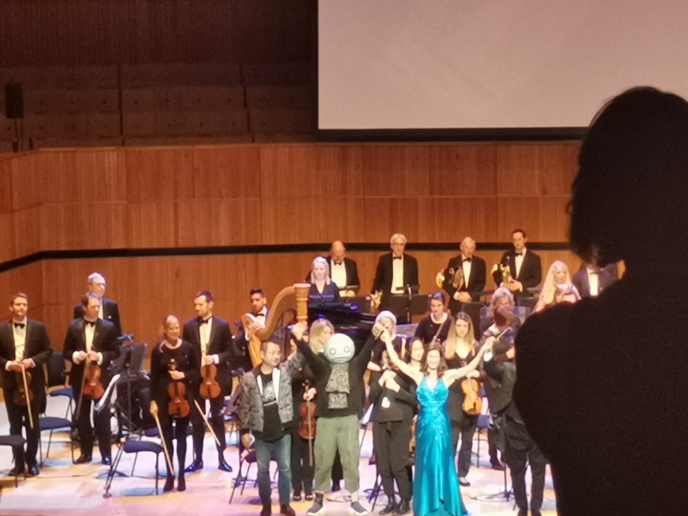
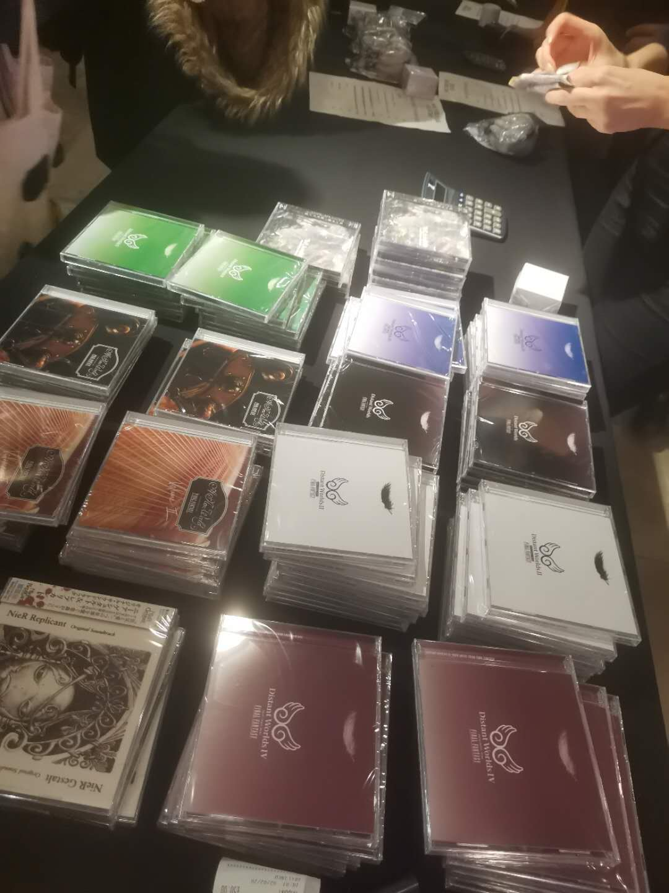

2018年机械纪元办音乐会的时候就在想为什么我不在国外，没想到今年刚落地英国就看到SE再举办的ins，经历重重波折拿到了一张门票，总算圆了一个去听Nier音乐会的心愿了。这大概就是命运吧( •́ω•̩̥̀ )

2号中午和YoRHa纽卡小分队吃过海底捞，一行人就开始往音乐厅前进。

抵达会场，看着现场不少于10个2B/9S，以及若干狄波拉和波波拉...完全不觉得意外——居然一个Emil都没有！这就是二刺螈音乐会该有的样子Σ(ﾟДﾟ；≡；ﾟдﾟ)

直到找到自己的座位坐下，我才意识到这场音乐会是Nier，而不是机械纪元专场。（PS：我隔壁的隔壁坐着一个长得特别像失忆症里Toma的金毛小哥(　ﾟ∀ﾟ)

比起18年的几场音乐会，这场的规模显然小了很多，开始前就隐隐担心...果然，黑人女高音没来（歌姬那首凉了QAQ！！！），很多曲目改成了合唱团人声伴奏，有几首改编略鬼畜甚至有点车祸。不过另一个白人小姐姐来了，weight of the world安排，稍感安慰...

全场的高潮大概是这货出场的时候吧( ╯' - ')╯ ┻━┻

总之这一天之内见到了冈部启一和横尾太郎，是值得纪念的大日子。

音乐会结束后，排了三个小时的队买周边，眼睁睁看着最后四个月之泪音乐盒在我肉眼可见的距离内被买走。为了显得这三个小时的队没白排，我买了横尾T恤。最后的最后，整个周边卖场，只剩下一堆FF的原声碟。

在尼尔的音乐会上卖最终幻想OST——**真有你的啊SE**！

愿人类荣光永存！

【ʚEndɞ】
