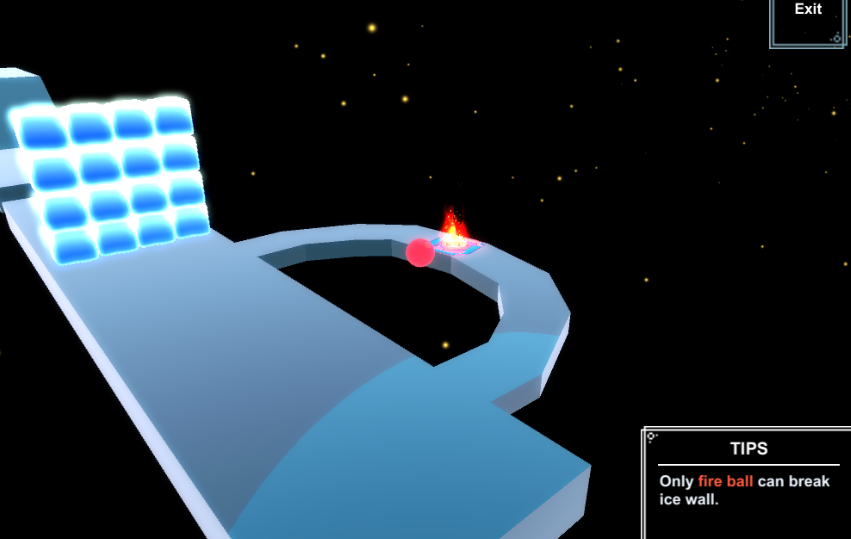
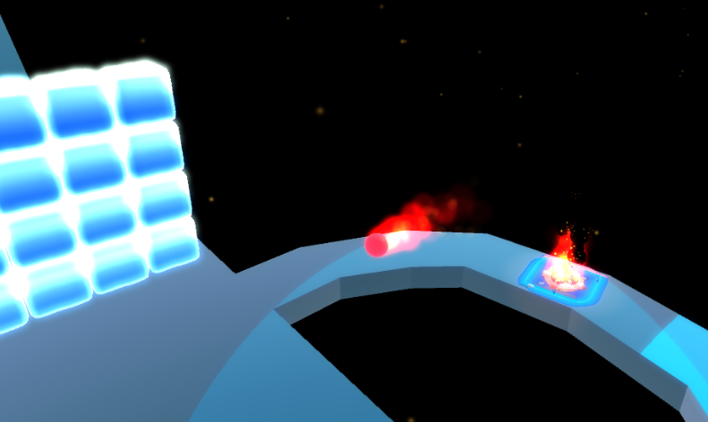
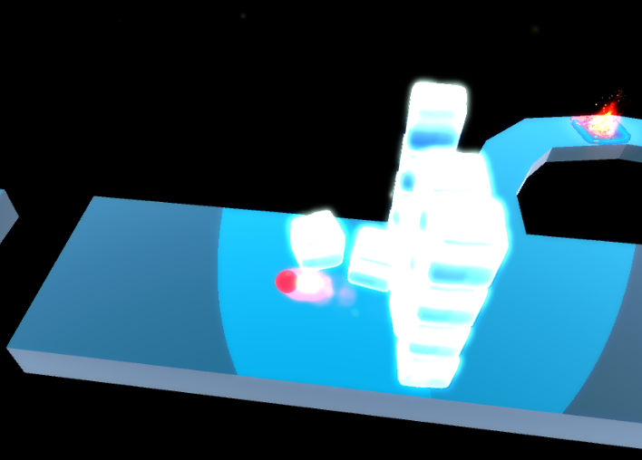
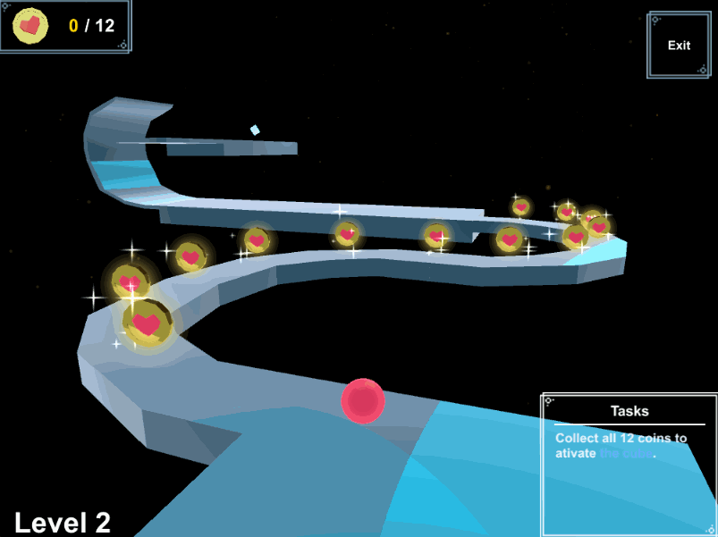
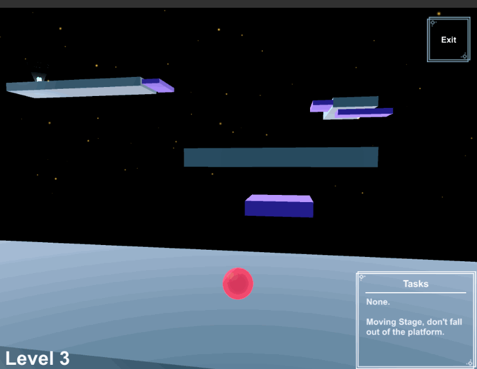
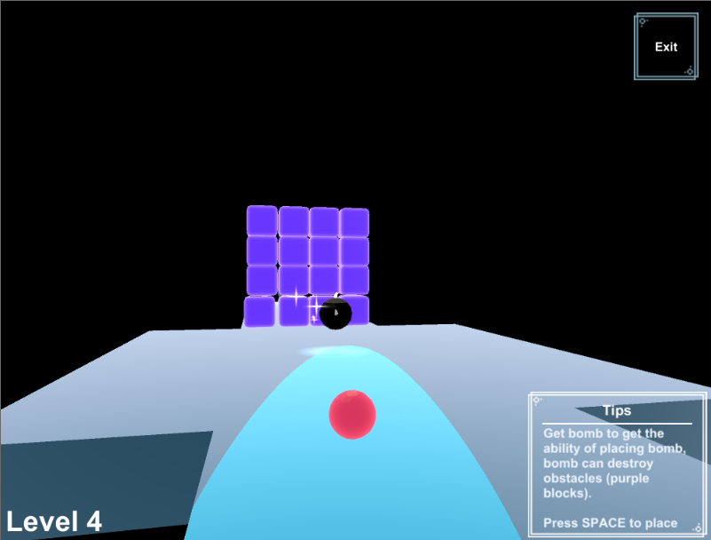
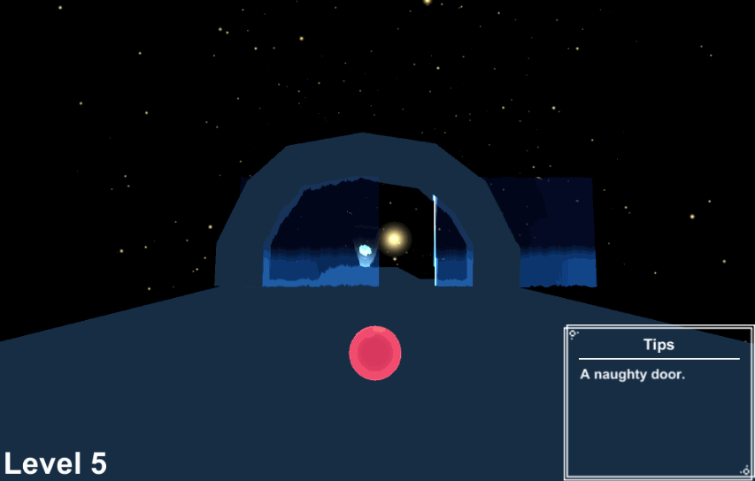
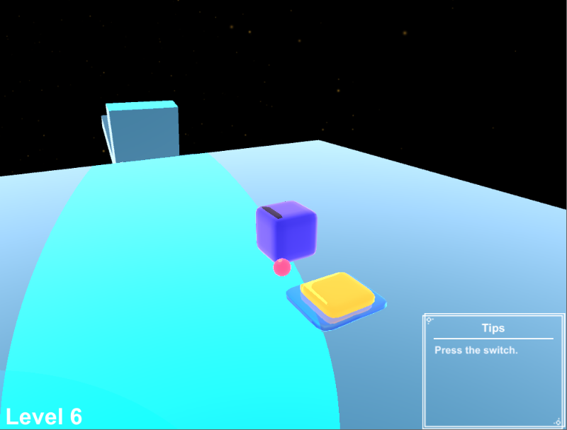

作业用土味Golf小游戏。

8 bit音乐和宇宙深空背景尽显年代感(ꐦ`•_•´)

游戏由个关卡构成，带一点解谜元素，玩家需要操控小球达成条件触发传送机制进入下一关。

### Level 1 元素

小球要打破坚固的冰墙才能抵达传送点。

### Level 2 收集任务

需要收集所有任务道具才能触发传送点。

### Level 3 移动平台

emmm因游戏极其糟心的物理体验荣获最难关卡评价(╯·_·)╯︵┻━┻

### Level 4 炸弹球

拾取炸弹道具获得放置炸弹的超能力。使用炸弹清除路上的障碍。

### Level 5 移动门

我最喜欢的一关。冲鸭！

### Level 6 机关

触发机关，使物体旋转运送小球抵达传送点。

emmmm原本的打算是通过旋转物体将球送到远处平台，错误示范↓

[Unity Demo](https://github.com/llapuras/LapuGolfGame/tree/master/LapuGolf)

<iframe width="560" height="315" src="https://www.youtube.com/embed/YAd2ZzEtEFk" frameborder="0" allow="accelerometer; autoplay; encrypted-media; gyroscope; picture-in-picture" allowfullscreen></iframe>
